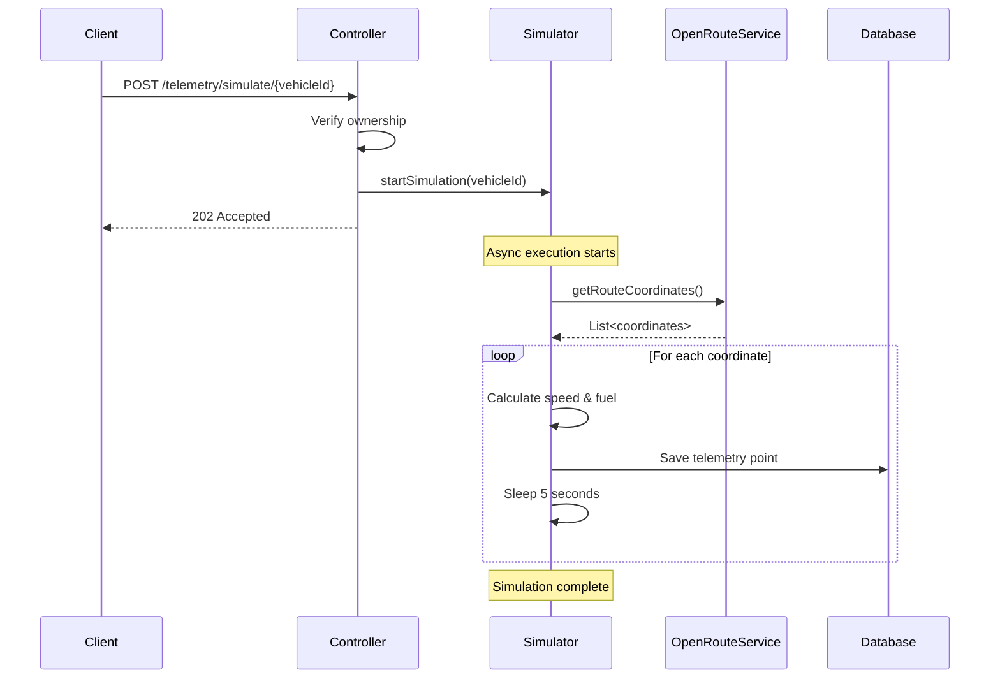

# Telemetry Simulator Service - Documentation

## Overview

The `TelemetrySimulatorService` provides realistic vehicle telemetry simulation by integrating with the OpenRouteService API to fetch real road coordinates. This service simulates a vehicle traveling along an actual route with realistic speed variations and fuel consumption.

## Architecture

```
IoT Bounded Context
  └── Application Layer
       └── services/
            └── TelemetrySimulatorService.java    ← Simulation service
```

## Features

✅ **Real Route Integration**: Uses OpenRouteService API to fetch actual road coordinates  
✅ **Asynchronous Execution**: Runs simulations in background threads using `@Async`  
✅ **Realistic Physics**: Simulates speed variations and fuel consumption  
✅ **Configurable Routes**: Default Lima route or custom start/end coordinates  
✅ **Real-time Simulation**: 5-second delays between telemetry points  
✅ **Graceful Error Handling**: Logs errors and handles API failures  
✅ **Fuel Management**: Stops simulation when fuel is depleted

## Default Configuration

```java
// Fixed simulation route in Lima, Peru
START_LAT = -12.046374  // Lima Centro
START_LNG = -77.042793
END_LAT = -12.050000    // Callao
END_LNG = -77.112500

// Simulation parameters
BASE_SPEED_KMH = 60.0               // Average speed
SPEED_VARIANCE = 15.0               // Speed variation (±15 km/h)
INITIAL_FUEL_LEVEL = 100.0          // Starting fuel percentage
FUEL_CONSUMPTION_RATE = 0.3         // Fuel consumed per point (%)
DELAY_BETWEEN_POINTS_MS = 5000      // 5 seconds between points
```

## API Endpoints

### 1. Start Default Simulation

**Endpoint**: `POST /api/v1/telemetry/simulate/{vehicleId}`

**Authorization**: `ROLE_ARRENDADOR` (Vehicle owner only)

**Description**: Starts a telemetry simulation using the default route (Lima Centro → Callao)

**Example Request**:
```bash
curl -X POST http://localhost:8080/api/v1/telemetry/simulate/1 \
  -H "Authorization: Bearer YOUR_JWT_TOKEN"
```

**Example Response**:
```json
{
  "message": "Telemetry simulation started for vehicle 1",
  "status": "running",
  "vehicleId": "1",
  "note": "Simulation is running asynchronously. Use GET /api/v1/telemetry/vehicle/1 to view results."
}
```

**HTTP Status**: `202 Accepted`

---

### 2. Start Custom Simulation

**Endpoint**: `POST /api/v1/telemetry/simulate/{vehicleId}/custom`

**Authorization**: `ROLE_ARRENDADOR` (Vehicle owner only)

**Description**: Starts a telemetry simulation with custom start and end coordinates

**Query Parameters**:
- `startLat` (double): Starting latitude
- `startLng` (double): Starting longitude
- `endLat` (double): Ending latitude
- `endLng` (double): Ending longitude

**Example Request**:
```bash
curl -X POST "http://localhost:8080/api/v1/telemetry/simulate/1/custom?startLat=-12.046374&startLng=-77.042793&endLat=-12.100000&endLng=-77.050000" \
  -H "Authorization: Bearer YOUR_JWT_TOKEN"
```

**Example Response**:
```json
{
  "message": "Custom telemetry simulation started for vehicle 1",
  "status": "running",
  "vehicleId": "1",
  "route": "(-12.046374, -77.042793) -> (-12.100000, -77.050000)",
  "note": "Simulation is running asynchronously. Use GET /api/v1/telemetry/vehicle/1 to view results."
}
```

**HTTP Status**: `202 Accepted`

---

### 3. View Simulation Results

**Endpoint**: `GET /api/v1/telemetry/vehicle/{vehicleId}`

**Authorization**: `ROLE_ARRENDADOR` or `ROLE_ARRENDATARIO` (with active booking)

**Description**: Retrieves all telemetry data points for a vehicle

**Example Request**:
```bash
curl -X GET http://localhost:8080/api/v1/telemetry/vehicle/1 \
  -H "Authorization: Bearer YOUR_JWT_TOKEN"
```

**Example Response**:
```json
[
  {
    "id": 1,
    "vehicleId": 1,
    "latitude": -12.046374,
    "longitude": -77.042793,
    "speed": 62.5,
    "fuelLevel": 99.7,
    "timestamp": "2025-11-25T16:30:00Z"
  },
  {
    "id": 2,
    "vehicleId": 1,
    "latitude": -12.046500,
    "longitude": -77.043000,
    "speed": 58.3,
    "fuelLevel": 99.4,
    "timestamp": "2025-11-25T16:30:05Z"
  }
]
```

## How It Works

### Simulation Flow



### Simulation Steps

1. **Authorization Check**: Verify the user owns the vehicle
2. **Route Fetching**: Call OpenRouteService API to get real road coordinates
3. **Asynchronous Loop**:
   - For each coordinate point:
     - Calculate realistic speed (60 ± 15 km/h)
     - Decrement fuel level by 0.3%
     - Create and save `Telemetry` entity
     - Wait 5 seconds before next point
4. **Completion**: Stop when route ends or fuel depletes

## Code Example

### Using the Service Directly

```java
@Service
public class MyCustomService {
    
    private final TelemetrySimulatorService simulator;
    
    @Autowired
    public MyCustomService(TelemetrySimulatorService simulator) {
        this.simulator = simulator;
    }
    
    public void simulateVehicleTrip(Long vehicleId) {
        // Default route (Lima)
        simulator.startSimulation(vehicleId);
        
        // Or custom route
        simulator.startSimulation(
            vehicleId,
            -12.046374, -77.042793,  // Start: Lima Centro
            -12.100000, -77.050000   // End: Custom location
        );
    }
}
```

## Telemetry Data Structure

Each telemetry point saved to the database contains:

| Field | Type | Description |
|-------|------|-------------|
| `id` | Long | Primary key (auto-generated) |
| `vehicleId` | Long | Vehicle identifier |
| `latitude` | Double | Geographic latitude |
| `longitude` | Double | Geographic longitude |
| `speed` | Double | Speed in km/h (60 ± 15) |
| `fuelLevel` | Double | Fuel percentage (0-100) |
| `createdAt` | Timestamp | When the point was recorded |

## Simulation Behavior

### Speed Simulation

```java
double speed = BASE_SPEED_KMH + ThreadLocalRandom.current()
    .nextDouble(-SPEED_VARIANCE, SPEED_VARIANCE);
speed = Math.max(0, speed); // Never negative
```

**Result**: Speed varies between 45 km/h and 75 km/h

### Fuel Consumption

```java
currentFuelLevel -= FUEL_CONSUMPTION_RATE; // 0.3% per point
currentFuelLevel = Math.max(0, currentFuelLevel);
```

**Example**: 
- Start: 100%
- After 100 points: 70%
- After 333 points: 0% (simulation stops)

### Time Simulation

With 5-second delays:
- 12 points per minute
- 720 points per hour
- A route with 100 points takes ~8.3 minutes

## Asynchronous Configuration

The service uses Spring's `@Async` annotation:

```java
@EnableAsync  // Added to CodexaTeamBackendApplication.java
public class CodexaTeamBackendApplication {
    // ...
}

@Async
public void startSimulation(Long vehicleId) {
    // Runs in separate thread
}
```

**Benefits**:
- Controller returns immediately (202 Accepted)
- Simulation runs in background
- No blocking of HTTP threads
- Multiple simulations can run concurrently

## Logging

The service provides detailed logging at different levels:

```
INFO  - Starting telemetry simulation for vehicle ID: 1
INFO  - Fetching route from OpenRouteService: (-12.046374, -77.042793) -> (-12.050000, -77.112500)
INFO  - Route retrieved successfully with 150 points. Starting simulation...
DEBUG - Telemetry point 1/150 saved for vehicle 1: lat=-12.046374, lng=-77.042793, speed=62.50, fuel=99.70
DEBUG - Telemetry point 2/150 saved for vehicle 1: lat=-12.046500, lng=-77.043000, speed=58.30, fuel=99.40
...
INFO  - Telemetry simulation completed for vehicle 1. Total points: 150
```

## Error Handling

### API Key Not Configured

```
ERROR - OpenRouteService is not configured. Cannot start simulation for vehicle 1
```

**Solution**: Set `openrouteservice.api.key` in application.properties

### No Route Found

```
ERROR - No route coordinates returned from OpenRouteService for vehicle 1
```

**Possible causes**:
- Invalid coordinates
- Route too long (>350km for free tier)
- API rate limit exceeded

### Simulation Interrupted

```
WARN - Simulation interrupted for vehicle 1
```

**Cause**: Thread was interrupted (application shutdown, manual cancellation)

## Performance Considerations

### Database Writes

- 1 INSERT per coordinate point
- Typical route: 50-200 points
- With 5-second delay: 4-17 minutes total

**Optimization**: Consider batch inserts if routes become very long

### Memory Usage

- Each coordinate: ~16 bytes
- Route of 200 points: ~3.2 KB
- Negligible memory impact

### Concurrent Simulations

- Each simulation runs in separate thread
- Spring's default async executor: unlimited threads
- Monitor thread pool if running many concurrent simulations

## Testing

### Unit Test Example

```java
@SpringBootTest
@TestMethodOrder(MethodOrderer.OrderAnnotation.class)
class TelemetrySimulatorServiceTest {
    
    @Autowired
    private TelemetrySimulatorService simulator;
    
    @Autowired
    private TelemetryRepository repository;
    
    @Test
    @Order(1)
    void testSimulationStartsSuccessfully() {
        // This will run async, so we just verify no exception is thrown
        assertDoesNotThrow(() -> {
            simulator.startSimulation(999L);
        });
    }
    
    @Test
    @Order(2)
    void testTelemetryDataIsSaved() throws InterruptedException {
        // Start simulation
        simulator.startSimulation(1000L);
        
        // Wait for some points to be saved
        Thread.sleep(15000); // Wait 15 seconds
        
        // Verify data was saved
        List<Telemetry> telemetry = repository.findByVehicleId(
            1000L, 
            Sort.by(Sort.Direction.ASC, "createdAt")
        );
        
        assertFalse(telemetry.isEmpty());
        assertTrue(telemetry.size() >= 2); // At least 2 points in 15 seconds
    }
}
```

### Integration Test

```bash
# 1. Start simulation
curl -X POST http://localhost:8080/api/v1/telemetry/simulate/1 \
  -H "Authorization: Bearer $TOKEN"

# 2. Wait a few seconds
sleep 10

# 3. Check results
curl -X GET http://localhost:8080/api/v1/telemetry/vehicle/1 \
  -H "Authorization: Bearer $TOKEN"

# Should return array with multiple telemetry points
```

## Security

- ✅ Only vehicle owners can start simulations (`@PreAuthorize("hasRole('ROLE_ARRENDADOR')")`)
- ✅ Authorization check before starting simulation
- ✅ Security exception if user doesn't own the vehicle
- ✅ JWT token required for all endpoints

## Limitations

1. **OpenRouteService Limits**:
   - 2,000 requests per day (free tier)
   - 40 requests per minute
   - 350 km maximum route distance

2. **Simulation**:
   - Fixed 5-second interval (not configurable via API)
   - Linear fuel consumption (doesn't account for terrain)
   - Speed variance is random (not based on road conditions)

3. **Concurrency**:
   - No limit on concurrent simulations per vehicle
   - Consider adding check to prevent multiple simulations for same vehicle

## Future Enhancements

- [ ] Configurable simulation speed (delay parameter)
- [ ] Pause/resume simulation
- [ ] Stop simulation endpoint
- [ ] Terrain-aware fuel consumption
- [ ] Traffic-based speed calculation
- [ ] WebSocket for real-time updates
- [ ] Simulation status endpoint
- [ ] History of simulations

---

**Created**: 2025-11-25  
**Version**: 1.0.0  
**Context**: IoT - Vehicle Telemetry Simulation with OpenRouteService Integration

